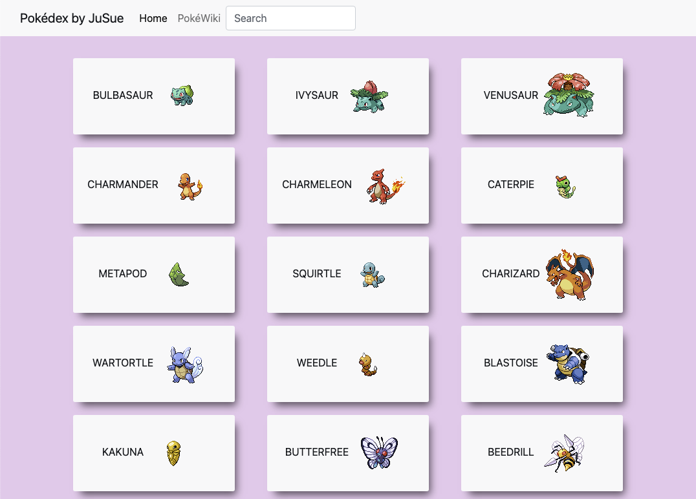
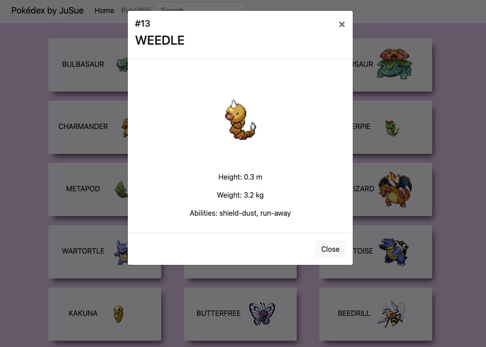

<h1 align="center">Welcome to the "Pokédex" App</h1>

> Pokédex is a small and easy to use web application. The app loads data from an external API and enables the viewing of details of each Pokémon by click.

## Description

- Users are enabled to scroll through the list of items and click on each of them to display a modal with further information.
- Via the search form on the right of the navigation bar users can type in the name of a Pokémon or just a few letters: the app dynamically displays all matching items. Any elements that do not match the users input are hidden.

### SCREENSHOTS

<table width="100%" style="overflow:auto">
  <tr>
    <td width="50%" style="text-align:center;"></td>
    <td width="50%" style="text-align:center;"></td>
  </tr>
</table>

## Built with

- HTML
- CSS
- JavaScript
- [Bootstrap](https://getbootstrap.com/)
- jQuery

## API

The App gets its information by an API called [Pokéapi](https://pokeapi.co/).

## Run the Project

Watch it live in action [here](https://lts-hmms.github.io/pokedex-list-app/) or download the Code and open the index.html file in your browser.
